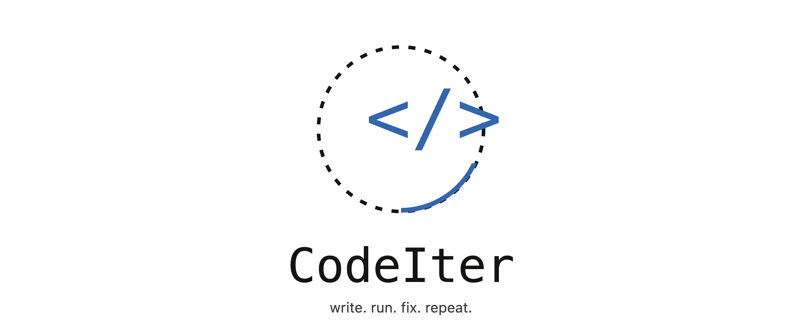

<p align="center">
  
</p>

# CodeIter

> write. run. fix. repeat.

CodeIter is a self-debugging coding agent. Give it a task, and it writes
Python code, runs it in a sandbox, reads the actual error if it fails, and
rewrites the code to fix that specific error — looping until it passes or
hits a max iteration limit.

Most "AI coding agents" generate code once and stop. CodeIter closes the
loop: **write -> run -> fix -> repeat.**

## How it works

1. The agent receives a task description.
2. It generates a Python script via the Claude API.
3. The script runs in a subprocess sandbox with a timeout.
4. If it fails, the real stdout/stderr traceback is fed back to the model.
5. The model rewrites the script to fix that specific error.
6. Repeat until success or `max_iterations` is hit.

## Install

```bash
git clone https://github.com/<your-username>/codeiter.git
cd codeiter
pip install -r requirements.txt
export ANTHROPIC_API_KEY=your_key_here
```

## Usage

```bash
python -m codeiter.cli "write a function that calculates the nth fibonacci number using memoization, then test it for n=20"
```

This prints each iteration's code and result, and reports how many
iterations it took to pass.

### As a library

```python
from codeiter import CodeIterAgent

agent = CodeIterAgent(max_iterations=5)
result = agent.run("write a function to parse a malformed CSV with mixed delimiters")

print(result.success)
print(result.final_code)
for attempt in result.attempts:
    print(attempt.iteration, attempt.success, attempt.stderr)
```

## Notes

- Code runs in a `subprocess` with a timeout — not a full container sandbox.
  Don't run untrusted tasks without further isolation (e.g. Docker, gVisor).
- `max_iterations` defaults to 5 to avoid runaway API usage.

## Roadmap

- [ ] Docker-based sandbox for safer execution
- [ ] Support for test-case based validation (not just "no error")
- [ ] Streamlit UI showing the iteration loop live
- [ ] Tool-creation: agent saves working functions for reuse across tasks

## License

MIT
